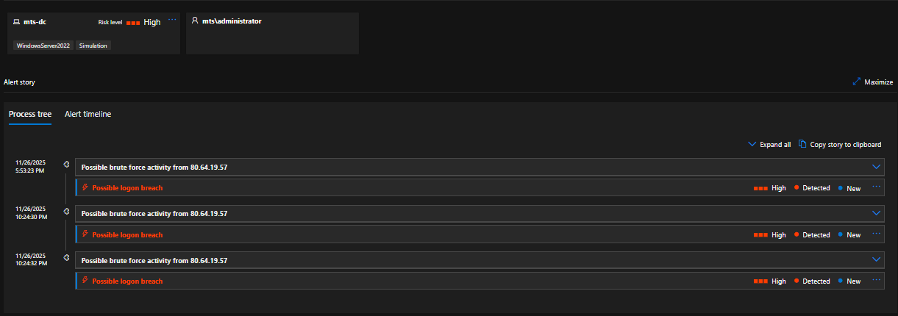
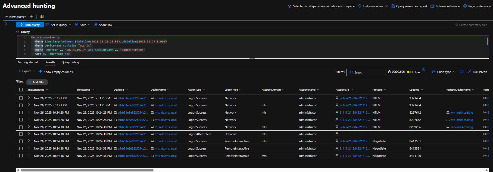
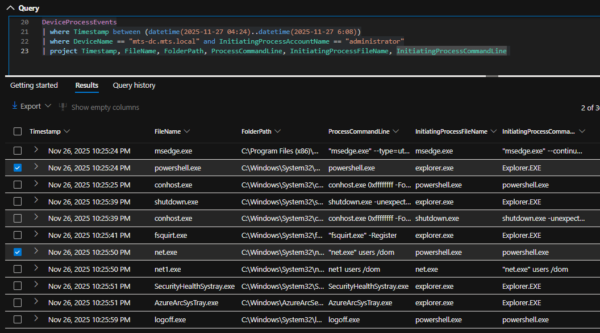
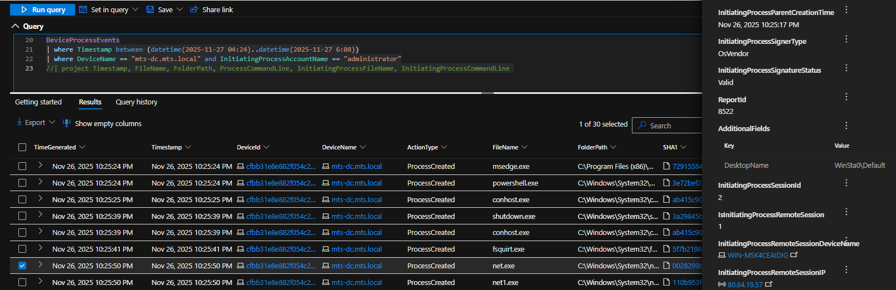
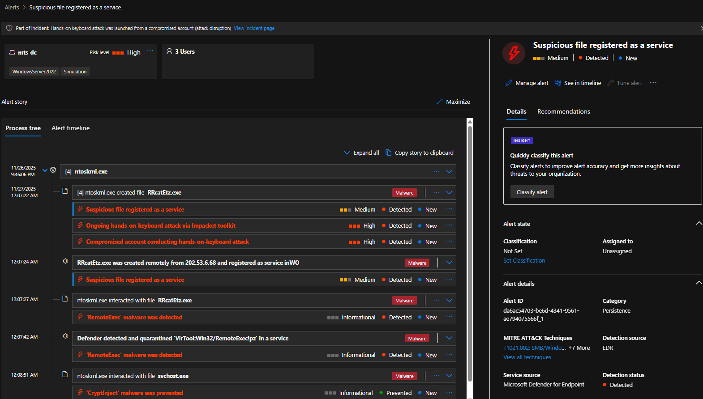
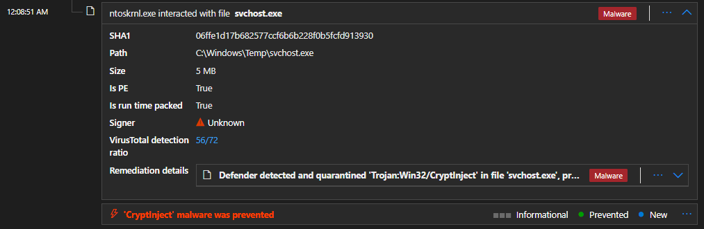
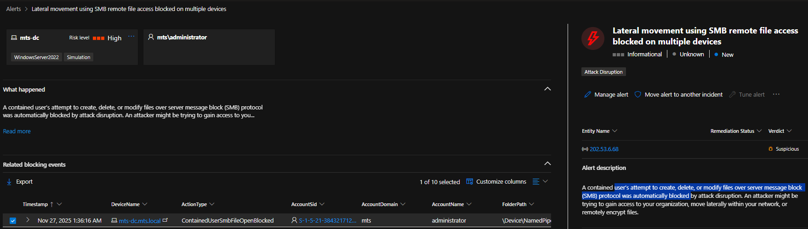
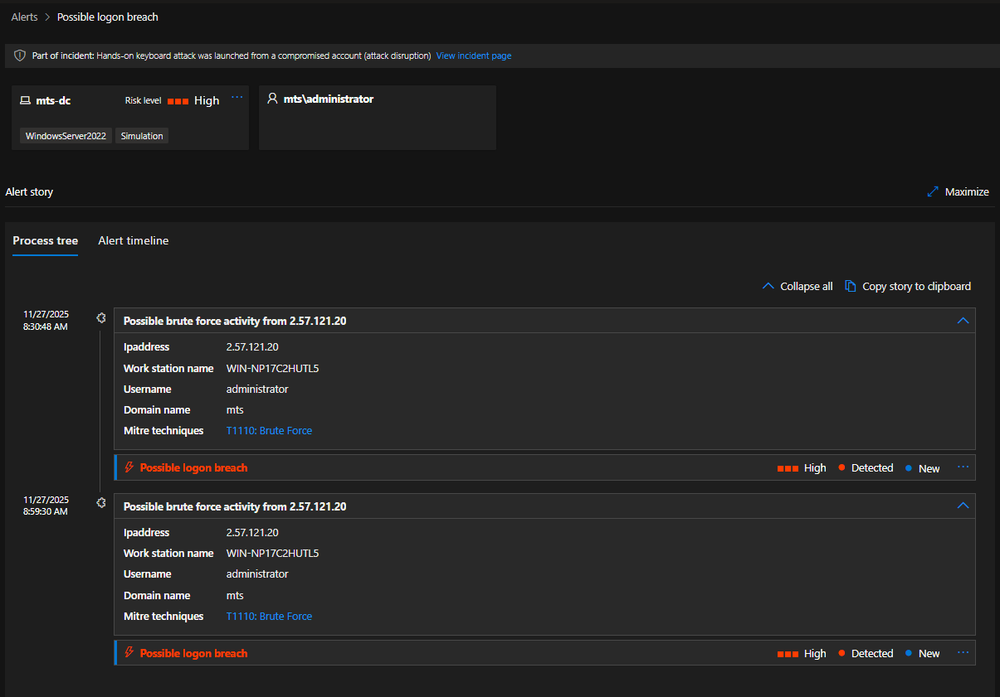

# SOC Investigation Walkthrough  
**Incident:** Hands-on Keyboard Attack Against Domain Controller  
**Date:** 2025-11-27  
**Target:** mts-dc.mts.local (Windows Server 2022 – Domain Controller)

---

## Step 1 — Initial Alert & Brute Force Activity

**Objective:** Identify the triggering alert and determine if malicious activity is present.

The investigation began after Microsoft Defender generated high-severity alerts indicating a **possible logon breach** and **brute force activity** against the domain controller. The alerts identified repeated authentication attempts originating from the external IP address `80.64.19.57`.

**Timeline correlation:**
- `2025-11-26 23:53:21` — Successful Network Logon from `80.64.19.57` (administrator)

*Defender alert timeline showing repeated brute force and suspicious authentication activity targeting the domain controller.*

**Analyst note:**  
At this stage, alerts alone do not confirm compromise. The objective is to determine whether authentication succeeded and whether interactive access occurred.

---

## Step 2 — Authentication Validation (Successful Logons Identified)

**Objective:** Determine whether brute force attempts resulted in successful authentication.

Authentication telemetry confirmed that the suspicious activity **did result in successful administrator authentication**. Initial access occurred via **Network logon (LogonType 3)**, followed by a successful **RemoteInteractive (RDP)** logon.

**Timeline correlation:**
- `2025-11-26 23:53:21` — Successful Network Logon from `80.64.19.57`
- `2025-11-27 04:24:38` — Successful RemoteInteractive Logon from `80.64.19.57`

*LogonSuccess events confirming administrator authentication from an external IP address.*

*Successful RemoteInteractive (RDP) logon to the domain controller using the administrator account, confirming hands-on-keyboard access.*

**Analyst note:**  
The RemoteInteractive logon marks the **confirmed point of compromise**.

---

## Step 3 — Post-Logon Activity Review (Attacker Discovery via net.exe)

**Objective:** Identify attacker-controlled activity following successful interactive authentication.

Following confirmation of RDP access, post-logon process execution telemetry was reviewed to identify signs of hands-on-keyboard activity.

This review identified **command-line–driven discovery activity** executed under the **administrator** account. The attacker executed `net.exe users /domain`, a common discovery technique used to enumerate domain users and validate privileges.

**Timeline correlation:**
- `2025-11-27 04:24:38` — Successful RemoteInteractive logon
- `2025-11-27 04:25:50` — `net.exe users /domain` executed
- `2025-11-27 04:25:59` — Logoff event

*Execution of net.exe with domain enumeration arguments under the administrator account, confirming hands-on-keyboard discovery activity.*

*Execution of net.exe users /domain initiated from remote session IP `80.64.19.57` and device `WIN-MSK4CEAIDIG`, confirming attacker-controlled activity.*

---

## Step 4 — Secondary Access & Malware Deployment

**Objective:** Identify follow-on activity after initial access.

Subsequent telemetry revealed additional access from a separate external IP, followed by suspicious file creation and service installation activity consistent with malware deployment.

**Timeline correlation:**
- `2025-11-27 06:07:14` — Network logon from `202.53.6.68`
- `2025-11-27 06:07:20` — File created: `RRcatEtz.exe`
- `2025-11-27 06:07:27` — New service created to execute `RRcatEtz.exe`

*Creation of a suspicious executable and associated Windows service, indicating persistence and post-exploitation tooling deployment.*

**Analyst note:**  
This activity represents a transition from reconnaissance to **persistence establishment**.

---

## Step 5 — Defense Evasion Attempt Detected

**Objective:** Identify attempts to evade security controls.

Microsoft Defender detected and prevented execution of a suspicious binary masquerading as `svchost.exe` running from a non-standard directory, consistent with a defense evasion technique.

**Timeline correlation:**
- `2025-11-27 06:08:51` — CryptInject behavior detected and blocked

*Defender detection of a malicious svchost.exe executing from an abnormal file path.*

---

## Step 6 — Lateral Movement Attempts Blocked

**Objective:** Assess lateral movement attempts and impact.

Multiple SMB-based access attempts originating from attacker infrastructure were observed and automatically blocked, preventing further expansion within the environment.

**Timeline correlation:**
- `2025-11-27 07:36:16` — SMBFileOpenBlocked from `202.53.6.68`
- `2025-11-27 10:54:43` — Additional SMBFileOpenBlocked event

*Defender blocking SMB-based lateral movement attempts from external attacker infrastructure.*

---

## Step 7 — Continued Credential Abuse & Re-Entry Attempts

**Objective:** Identify further attempts to reuse compromised credentials.

Additional administrator authentication attempts were observed from new external infrastructure, followed by attempted domain discovery. Defender containment controls successfully blocked further access.

**Timeline correlation:**
- `2025-11-27 14:30:48` — Administrator login from `2.57.121.20`
- `2025-11-27 14:59:33` — ContainedUserRpcAccessBlocked
- `2025-11-27 14:59:56` — Blocked domain discovery commands

*Blocked credential reuse and discovery activity following containment enforcement.*

---

## Step 8 — Incident Scope & Final Assessment

**Objective:** Understand the full scope of the attack.

The Defender incident graph was reviewed to visualize relationships between attacker infrastructure, affected assets, user accounts, and malicious activity.

*Incident graph illustrating attacker interactions, affected assets, and investigation scope.*

---

## Investigation Outcome

- Brute force activity resulted in successful administrator authentication  
- Hands-on-keyboard access confirmed via RDP and discovery commands  
- Malware deployment and persistence attempts identified  
- Defense evasion techniques detected and blocked  
- Lateral movement attempts prevented  
- Multiple re-entry attempts observed and successfully contained  
