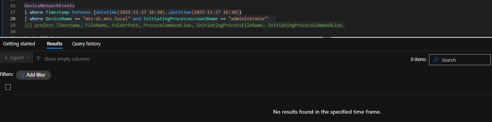
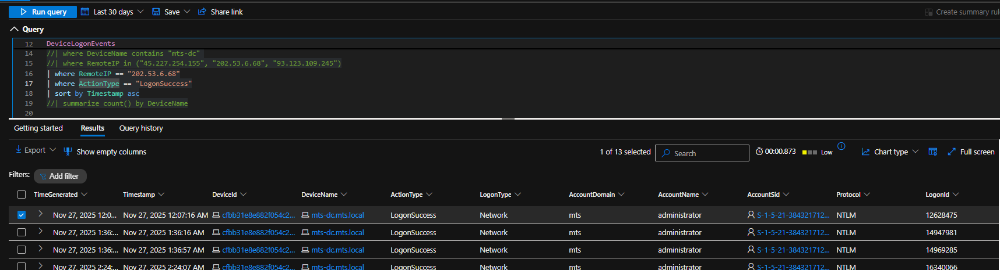
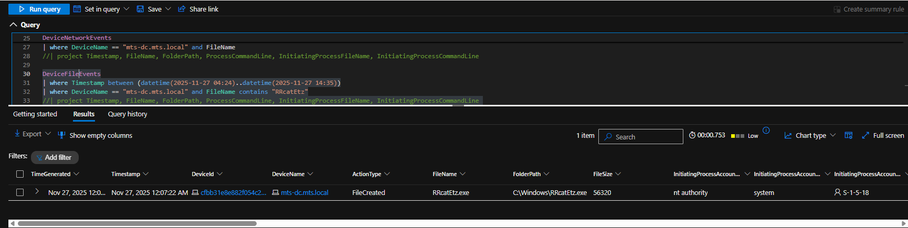
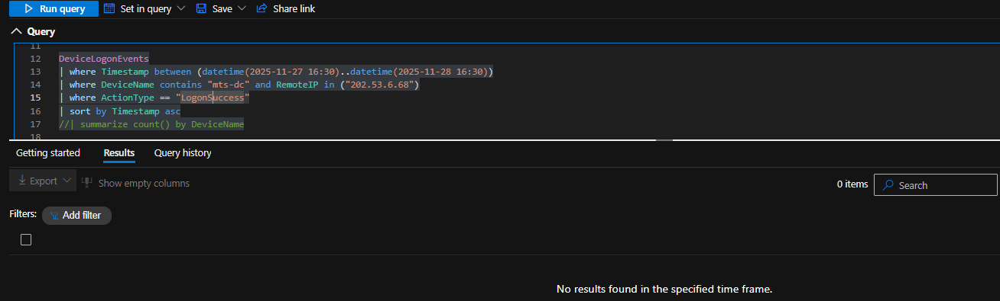
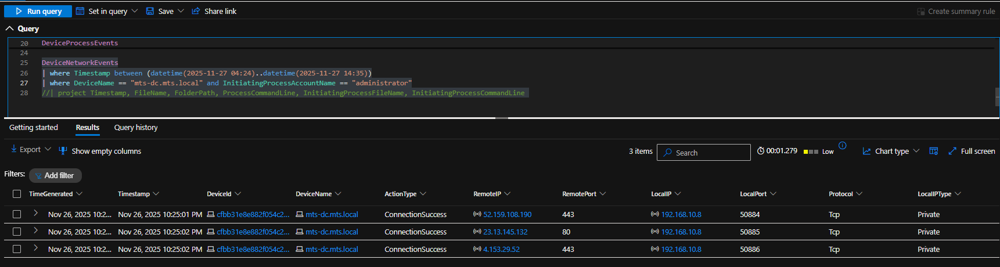

# SOC Investigation Walkthrough  
## Hands-On Keyboard Activity on Domain Controller

**Date:** 2025-11-27  
**Affected Host:** `mts-dc.mts.local` (Windows Server 2022 – Domain Controller)  
**Account Involved:** `mts\administrator`  
**Tools Used:** Microsoft Defender XDR, Advanced Hunting (KQL)

---

## Step 1 — Initial Alert: Possible Logon Breach

**Objective:** Identify the triggering alert and determine whether unauthorized access may have occurred.

The investigation began with a **Microsoft Defender alert indicating a possible logon breach** on the domain controller. The alert flagged suspicious authentication activity involving an administrator account.

*Initial Defender alert indicating a possible logon breach on the domain controller*

---

## Step 2 — Alert Story & Timeline Review

**Objective:** Determine whether the alert represents a single event or repeated activity.

Reviewing the **Defender alert story and timeline** revealed multiple related alerts, including **possible brute-force activity** and repeated **possible logon breach detections** targeting the same administrator account over a short period of time.

*Defender alert story showing repeated possible logon breach and brute-force activity*

---

## Step 3 — Authentication Validation (Advanced Hunting)

**Objective:** Confirm whether suspicious authentication attempts were successful.

Advanced Hunting queries against **DeviceLogonEvents** confirmed:
- Multiple **successful network logons**
- Use of the **administrator** account
- NTLM authentication
- Logons originating from **external IP addresses**

This validated that **valid credentials were successfully used**, escalating the investigation from attempted access to **confirmed credential abuse**.

*Successful NTLM-based administrator logons from external IP addresses*

---

## Step 4 — Incident Correlation: Hands-On Keyboard Activity

**Objective:** Determine whether successful logons led to interactive attacker behavior.

Microsoft Defender XDR correlated the authentication activity into a broader incident and identified **hands-on keyboard activity**, indicating manual interaction rather than automated malware execution.

*Defender XDR incident overview showing hands-on keyboard activity*

---

## Step 5 — Interactive Process Execution

**Objective:** Validate human-driven activity on the domain controller.

Process telemetry showed:
- Interactive PowerShell execution
- Native Windows tools launched
- Activity tied directly to administrator logon sessions

The timing and execution flow strongly supported **hands-on keyboard behavior**.

*Interactive PowerShell and native process execution under administrator context*

---

## Step 6 — Discovery and Enumeration Activity

**Objective:** Identify attacker intent following privileged access.

Following interactive access, telemetry showed:
- LDAP search activity
- Directory and account enumeration
- Discovery actions aligned with Active Directory reconnaissance

This behavior is consistent with post-compromise **domain discovery**.

*LDAP-based discovery activity indicating Active Directory reconnaissance*

---

## Step 7 — Suspicious File Activity

**Objective:** Identify potential attacker tooling or payloads.

File events revealed:
- Creation of a previously unseen executable
- Execution shortly after discovery activity
- Elevated execution context on the domain controller

The file was later flagged by Defender as suspicious.

*Creation of a suspicious executable on the domain controller*

---

## Step 8 — Defender Detection & Attack Disruption

**Objective:** Confirm security control response and containment.

Microsoft Defender XDR:
- Detected the suspicious executable
- Generated high-confidence alerts
- Initiated **automated attack disruption actions**

This response interrupted the activity before further progression.

*Defender XDR incident graph showing automated attack disruption actions*

---

## Step 9 — Scope and Impact Assessment

**Objective:** Determine whether the compromise spread or persisted.

Further investigation showed:
- No confirmed persistence mechanisms
- No lateral movement beyond the domain controller
- No evidence of data exfiltration

Network telemetry during the timeframe showed expected outbound connections only.

*Network telemetry showing no evidence of data exfiltration*

---

## Walkthrough Summary

This investigation demonstrates:
- Detection of credential abuse via Defender alerts
- Validation of successful administrator logons
- Identification of hands-on keyboard activity
- Active Directory discovery and enumeration
- Detection of suspicious file execution
- Automated attack disruption by Defender XDR
- Effective scoping to confirm limited impact

➡️ **For conclusions, remediation actions, and lessons learned, see the formal investigation report.**

📄 [Investigation Report (PDF)](investigation-report/investigation-report.pdf)
