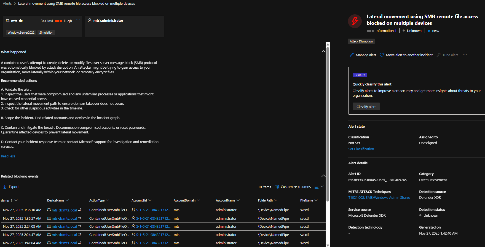
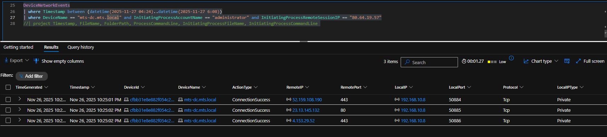
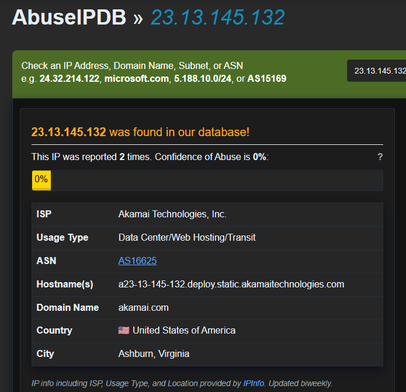
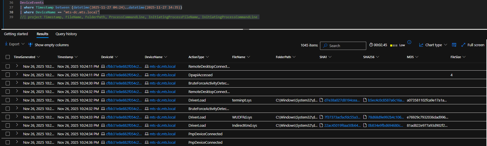
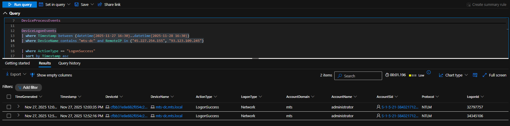
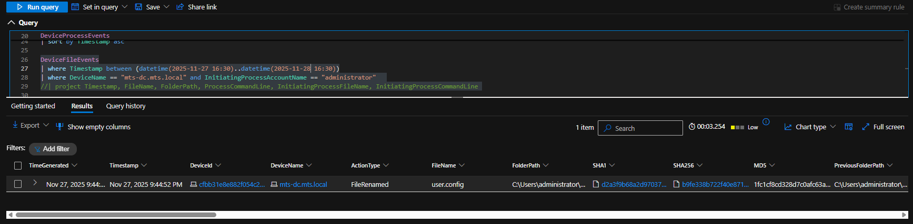
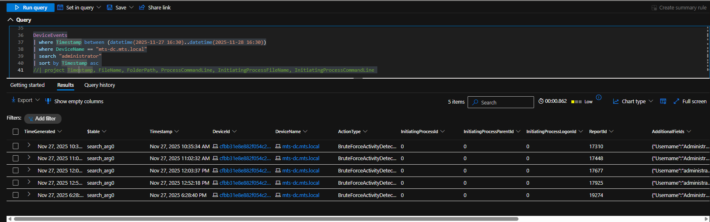

# SOC Investigation Walkthrough  
**Incident:** Hands-On Keyboard Attack Against Domain Controller  
**Date:** 2025-11-27  
**System:** mts-dc.mts.local (Windows Domain Controller)  
**Primary Account Targeted:** administrator  

---

## Step 1 — Initial Alert: Possible Logon Breach

**Objective:** Identify why the investigation started.

The investigation began with a **Microsoft Defender alert indicating a possible logon breach** on the domain controller. The alert flagged suspicious authentication behavior involving the **administrator** account and required validation.

*Initial Defender alert indicating a possible logon breach on the domain controller*

---

## Step 2 — Alert Story & Pattern Recognition

**Objective:** Determine whether the alert represents isolated activity or a pattern.

Reviewing the Defender alert story and timeline showed **repeated brute-force and possible logon breach alerts** tied to the same account over time. This pattern indicated intentional credential targeting rather than a benign anomaly.

*Defender alert story showing repeated suspicious authentication attempts*

---

## Step 3 — Authentication Validation (Were Any Logons Successful?)

**Objective:** Confirm whether the attacker successfully authenticated.

Authentication telemetry (`DeviceLogonEvents`) was reviewed to validate whether any of the suspicious attempts resulted in successful access.

The results confirmed **multiple successful NTLM network logons** using the **administrator** account from an external IP address.

- **Source IP:** `80.64.19.57`  
- **Authentication:** NTLM  
- **Account:** administrator  

*Successful NTLM-based administrator logons from an external IP address*

📌 **IOC Identified:** `80.64.19.57`

---

## Step 4 — Pivot on Initial IOC (Attacker IP)

**Objective:** Determine what actions occurred after successful authentication.

After identifying `80.64.19.57` as the source of successful logons, the investigation pivoted to **process execution telemetry** to determine whether the attacker performed actions post-logon.

*DeviceProcessEvents showing interactive PowerShell activity and domain discovery commands (`net.exe`, `net1.exe`) executed under the administrator account, directly associated with the attacker IP `80.64.19.57`.*

---

## Step 5 — Confirm Hands-On Keyboard Activity

**Objective:** Validate whether activity was interactive.

Process telemetry showed execution of **PowerShell and native Windows utilities** under the administrator context shortly after authentication. The timing and tool selection indicate **human-driven, hands-on keyboard activity**.

*Interactive PowerShell and built-in Windows utilities executed under the administrator account*

---

## Step 6 — Discovery and Reconnaissance Activity

**Objective:** Identify attacker intent following access.

Command-line telemetry confirmed discovery activity, including execution of `whoami.exe` and domain-related enumeration commands. These actions indicate the attacker was validating privileges and assessing the environment.

*Execution of discovery commands indicating environment reconnaissance*

---

## Step 7 — Expansion of Attacker Infrastructure Observed

**Objective:** Identify whether additional infrastructure was used.

Subsequent authentication and network telemetry showed activity originating from a **second external IP address**, indicating attacker infrastructure rotation.

- **Source IP:** `202.53.6.68`

*Network activity originating from secondary attacker infrastructure*

📌 **IOC Identified:** `202.53.6.68`

---

## Step 8 — Malicious File Creation Detected

**Objective:** Identify malicious artifacts written to disk.

File creation telemetry revealed a **previously unseen executable** written to the Windows directory.

- **File:** `RRcatEtz.exe`  
- **Path:** `C:\Windows\RRcatEtz.exe`

*Creation of malicious executable RRcatEtz.exe on the domain controller*

📌 **IOC Identified (SHA-256):**  
`3c2fe308c0a563e06263bbacf793bbe9b2259d795fcc36b953793a7e499e7f71`

---

## Step 9 — Persistence Attempt via Service Creation

**Objective:** Identify persistence mechanisms.

Shortly after the file drop, a **new Windows service** was created to execute the malicious binary, indicating an attempt to establish persistence.

- **Service Name:** `inWO`  
- **Executable:** `RRcatEtz.exe`

*Creation of a malicious service configured to execute RRcatEtz.exe*

📌 **IOC Identified:** Service name `inWO`

---

## Step 10 — Defender Detection and Prevention (CryptInject)

**Objective:** Validate defensive response.

Microsoft Defender detected and prevented **CryptInject behavior** involving a suspicious `svchost.exe` executing from a non-standard path.

- **Detected Path:** `C:\Windows\Temp\svchost.exe`  
- **Legitimate Path:** `C:\Windows\System32\svchost.exe`

*Defender detection preventing CryptInject behavior*

📌 **IOC Identified (SHA-256):**  
`60b6d7664598e6a988d9389e6359838be966dfa54859d5cb1453cbc9b126ed7d`

---

## Step 11 — Lateral Movement Attempts Blocked

**Objective:** Identify attempted spread within the environment.

SMB-based lateral movement attempts originating from attacker infrastructure were **automatically blocked** by Defender.

*SMB file access attempts automatically blocked by Defender*

---

## Step 12 — Post-Containment Access Attempts

**Objective:** Identify follow-on attacker behavior.

After containment actions, additional administrator logons and domain enumeration commands were attempted from **new external infrastructure**, but were blocked.

- **Source IP:** `2.57.121.20`  
- **Host:** `WIN-NP17C2HUTL5`

*Blocked domain enumeration attempts following user containment*

📌 **IOC Identified:**  
- `2.57.121.20`  
- `WIN-NP17C2HUTL5`

---

## Step 13 — Final Observed Access Attempt

**Objective:** Identify residual attacker activity.

A final administrator login attempt was observed from a different external IP address, indicating continued but unsuccessful attacker interest.

- **Source IP:** `93.123.109.245`

*Final observed administrator login attempt from external infrastructure*

📌 **IOC Identified:** `93.123.109.245`

---

## IOC Summary (Derived During Investigation)

| Type | Value | Context |
|----|------|--------|
| IP | 80.64.19.57 | Initial brute force + successful NTLM admin logons |
| IP | 202.53.6.68 | Malware drop, service creation, SMB attempts |
| IP | 2.57.121.20 | Post-containment admin access attempts |
| IP | 93.123.109.245 | Final observed login attempt |
| File Hash | 3c2fe308c0a563e06263bbacf793bbe9b2259d795fcc36b953793a7e499e7f71 | RRcatEtz.exe |
| File Hash | 60b6d7664598e6a988d9389e6359838be966dfa54859d5cb1453cbc9b126ed7d | Fake svchost.exe (CryptInject) |
| Service | inWO | Persistence mechanism |

---

## Final Assessment

- **Attack Type:** Hands-on keyboard domain controller compromise  
- **Initial Access:** NTLM administrator authentication following brute-force activity  
- **Persistence Attempt:** Malicious service creation  
- **Defensive Outcome:** Execution, lateral movement, and discovery blocked by Defender  
- **Impact:** Contained before successful lateral movement or data exfiltration  

➡️ See the **Investigation Report** for remediation actions and lessons learned.
