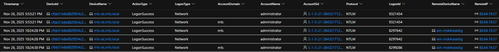

# SOC Investigation Walkthrough  
**Incident:** Hands-on Keyboard Attack Against Domain Controller  
**Date:** 2025-11-27  
**Target:** mts-dc.mts.local (Windows Server 2022 – Domain Controller)

---

## Step 1 — Initial Alert & Brute Force Activity

**Objective:** Identify the triggering alert and determine if malicious activity is present.

The investigation began after Microsoft Defender generated high-severity alerts indicating a **possible logon breach** and **brute force activity** against the domain controller. The alerts pointed to repeated authentication attempts originating from the external IP address `80.64.19.57`.

**Timeline correlation:**
- `2025-11-26 23:53:23` – Brute force activity from `80.64.19.57`

*Defender alert timeline showing repeated brute force and possible logon breach alerts targeting the domain controller.*

---

## Step 2 — Authentication Validation (Successful Logons Identified)

**Objective:** Determine whether brute force attempts resulted in successful authentication.

Authentication telemetry confirmed that the brute force activity **did result in successful administrator logons** using NTLM authentication.

**Timeline correlation:**
- `2025-11-26 23:53:21` – Successful network logon from `80.64.19.57` (administrator)
- `2025-11-27 04:24:38` – Successful remote logon from `80.64.19.57`

*LogonSuccess events confirming administrator authentication via NTLM from an external IP address.*

*Successful RemoteInteractive logon to the domain controller using the administrator account, indicating authenticated remote access from an external source.*

---

## Step 3 — Post-Logon Activity Review (Initial Hands-on Interaction)

**Objective:** Determine whether successful authentication led to attacker interaction.

Following the confirmed logon, process execution telemetry was reviewed. Shortly after authentication, the attacker executed discovery commands to validate access and privileges.

**Timeline correlation:**
- `2025-11-27 04:25:50` – Discovery command executed (`whoami.exe`)
- `2025-11-27 04:25:59` – Logoff event

*Execution of discovery commands shortly after successful administrator authentication.*

---

## Step 4 — Secondary Access & Malware Deployment

**Objective:** Identify escalation or follow-on activity after initial access.

Later telemetry showed additional access attempts from a different external IP, followed by suspicious file creation and service installation activity consistent with malware deployment.

**Timeline correlation:**
- `2025-11-27 06:07:14` – Network logon from `202.53.6.68`
- `2025-11-27 06:07:20` – File created: `RRcatEtz.exe`
- `2025-11-27 06:07:27` – New service created to execute `RRcatEtz.exe`

*Creation of a suspicious executable and associated service indicating persistence activity.*

---

## Step 5 — Defense Evasion Attempt Detected

**Objective:** Identify attempts to evade security controls.

Defender detected and prevented a suspicious executable masquerading as `svchost.exe` running from a non-standard directory, indicating an attempted defense evasion technique.

**Timeline correlation:**
- `2025-11-27 06:08:51` – CryptInject behavior detected and blocked

*Defender detection showing a malicious svchost.exe executed from an abnormal file path.*

---

## Step 6 — Lateral Movement Attempts Blocked

**Objective:** Assess lateral movement attempts and impact.

Multiple SMB file access attempts originating from attacker infrastructure were observed and automatically blocked, preventing further spread within the environment.

**Timeline correlation:**
- `2025-11-27 07:36:14` – SMBFileOpenBlocked from `202.53.6.68`
- `2025-11-27 10:54:43` – Additional SMBFileOpenBlocked event

*Defender blocking SMB-based lateral movement attempts from external attacker IPs.*

---

## Step 7 — Continued Credential Abuse Attempts

**Objective:** Identify further attempts to reuse compromised credentials.

Additional administrator logons were detected from new external systems, followed by domain discovery activity. Defender containment controls prevented further compromise.

**Timeline correlation:**
- `2025-11-27 14:30:48` – Administrator login from `2.57.121.20`
- `2025-11-27 14:59:56` – Domain discovery commands executed
- `2025-11-27 14:59:33` – ContainedUserRpcAccessBlocked event

*Blocked credential reuse and discovery activity following containment enforcement.*

---

## Step 8 — Incident Scope & Final Assessment

**Objective:** Understand the full scope of the attack.

The Defender incident graph was reviewed to visualize relationships between affected assets, attacker IPs, processes, and user accounts.

*Incident graph illustrating attacker interactions, affected assets, and investigation scope.*

---

## Investigation Outcome

- Brute force attack resulted in successful administrator authentication  
- Hands-on-keyboard activity confirmed through interactive discovery commands  
- Malware deployment and persistence attempts identified  
- Defense evasion techniques detected and blocked  
- Lateral movement attempts prevented  
- Attack successfully contained through Defender disruption actions
