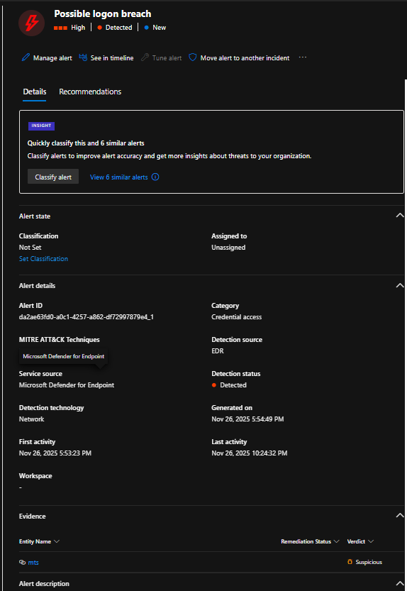
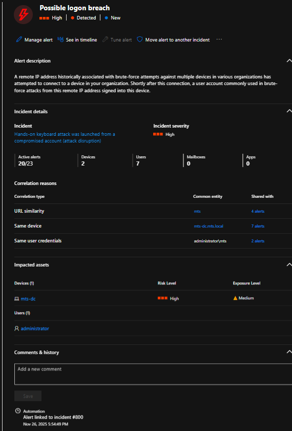
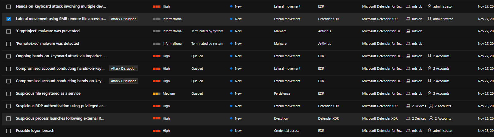

# SOC Investigation Walkthrough  
**Incident:** Hands-on Keyboard Attack Against Domain Controller  
**Date:** 2025-11-27  
**Target:** mts-dc.mts.local (Windows Server 2022 – Domain Controller)

---

## Step 1 — Initial Alert & Brute Force Activity

**Objective:** Identify the triggering alert and determine if malicious activity is present.

The investigation began after Microsoft Defender generated high-severity alerts indicating a **possible logon breach** and **brute force activity** against the domain controller. The alerts pointed to repeated authentication attempts originating from the external IP address `80.64.19.57`.

**Timeline correlation:**
- `2025-11-26 23:53:23` – Brute force activity from `80.64.19.57`

---

## Step 2 — Authentication Validation (Successful Logons Identified)

**Objective:** Determine whether brute force attempts resulted in successful authentication.

Authentication telemetry confirmed that the brute force activity **did result in successful administrator logons** using NTLM authentication.

**Timeline correlation:**
- `2025-11-26 23:53:21` – Successful network logon from `80.64.19.57` (administrator)
- `2025-11-27 04:24:38` – Successful remote logon from `80.64.19.57`

---

## Step 3 — Post-Logon Activity Review (Initial Hands-on Interaction)

**Objective:** Determine whether successful authentication led to attacker interaction.

Following the confirmed logon, process execution telemetry was reviewed to identify post-authentication activity. Shortly after the successful remote logon, the attacker executed discovery commands to validate access and context.

**Timeline correlation:**
- `2025-11-27 04:25:50` – Discovery command executed (`whoami.exe`)
- `2025-11-27 04:25:59` – Logoff event

This activity confirms **interactive hands-on-keyboard behavior** rather than automated exploitation.

---

## Step 4 — Secondary Access & Malware Deployment

**Objective:** Identify escalation or follow-on activity after initial access.

Later telemetry showed additional access attempts from a different external IP, followed by file creation and service installation activity consistent with malware deployment and persistence.

**Timeline correlation:**
- `2025-11-27 06:07:14` – Network logon from `202.53.6.68`
- `2025-11-27 06:07:20` – File created: `RRcatEtz.exe`
- `2025-11-27 06:07:27` – New service created (`inWO`) executing `RRcatEtz.exe`

---

## Step 5 — Defense Evasion Attempt Detected

**Objective:** Identify attempts to evade security controls.

Defender detected and prevented an executable masquerading as `svchost.exe` running from a non-standard directory, indicating a likely **process injection or masquerading attempt**.

**Timeline correlation:**
- `2025-11-27 06:08:51` – CryptInject behavior detected and blocked  
  - Malicious path: `C:\Windows\Temp\svchost.exe`
  - Legitimate path should be: `C:\Windows\System32\svchost.exe`

---

## Step 6 — Lateral Movement Attempts Blocked

**Objective:** Assess lateral movement and impact.

Subsequent activity showed multiple **SMB file access attempts** from the attacker infrastructure. These attempts were automatically blocked by Defender, preventing further lateral movement.

**Timeline correlation:**
- `2025-11-27 07:36:14` – SMBFileOpenBlocked from `202.53.6.68`
- `2025-11-27 10:54:43` – Additional SMBFileOpenBlocked event

---

## Step 7 — Continued Credential Abuse Attempts

**Objective:** Identify further attempts to reuse compromised credentials.

Additional administrator logons were observed from new external systems, followed by discovery commands and access attempts. Defender containment prevented further compromise.

**Timeline correlation:**
- `2025-11-27 14:30:48` – Administrator login from `2.57.121.20`
- `2025-11-27 14:59:56` – Domain discovery commands executed
- `2025-11-27 14:59:33` – ContainedUserRpcAccessBlocked (attack failed)

---

## Step 8 — Incident Scope & Final Assessment

**Objective:** Summarize impact and response.

The Defender incident graph was reviewed to understand the overall scope of the attack, including affected assets, IP addresses, and user accounts.

---

## Investigation Outcome

- Initial brute force attack resulted in successful administrator authentication
- Hands-on-keyboard activity confirmed through interactive discovery commands
- Malware deployment and persistence attempted
- Defense evasion techniques detected and blocked
- Lateral movement attempts prevented
- Attack contained through automated Defender disruption actions
